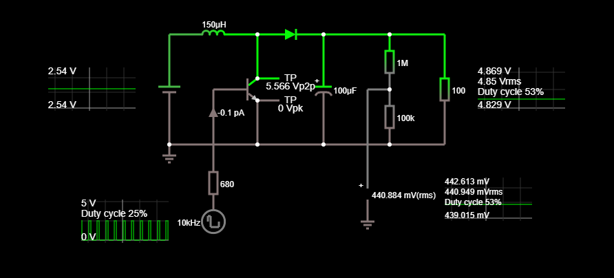

# Arduino Boost Converter

## Pin Configuration

---

* PB0 - Fast PWM output
* PB5 - ADC Output voltage monitoring
* PB2 - ADC Input voltage monitoring
* PB3 - Button (-) Output voltage decrease
* PB4 - Button (+) Output voltage increase
* PB1 - TX (Software serial output voltage tx)

## Math

---

### Continuous mode

---

When a boost converter operates in continuous mode, the current through the inductor (IL) never falls to zero.

\
Voltage output
> Voutput = Vinput / (1 - D)

Where D is the ON time duty cycle in range from 0 to 1

\
Current in the inductor while in ON state
> ΔILON = DTVi / L

Where D is duty cycle in range from 0 to 1 and T is period ( 1/f ) \

Continuous mode graph \

---

### Discontinuous mode

---

As the inductor current at the beginning of the cycle is zero, its maximum value ( t=DT ) is:
> ILMax = ViDT / L

Discontinuous mode graph

### Simulation snapshots (BJT  β=200)

---

At D = 0.25

At D = 0.75
